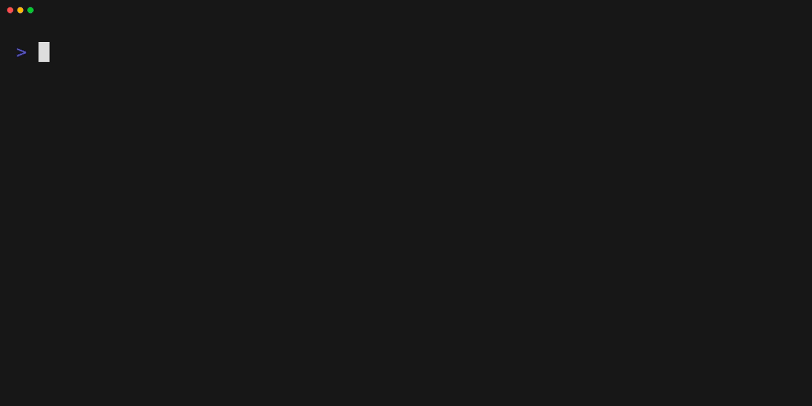

# tracker

A simple tool to track time.



## Usage

```
$ tracker --help
Simple tool to do time tracking

Usage: tracker [OPTIONS] <COMMAND>

Commands:
  add     Add a track entry [aliases: a]
  view    Display tracking list entries [aliases: v]
  delete  Remove entries from a tracking list [aliases: d]
  edit    Edit an entry from a tracking list [aliases: e]
  help    Print this message or the help of the given subcommand(s)

Options:
  -c, --config <CONFIG>  Path to a config file
  -h, --help             Print help
  -V, --version          Print version
```

A full documentation of all commands and parameters can be found [**here**](docs/commands.md).

## Install

You can either download the latest release builds form the [Releases page](https://github.com/shellshape/tracker/releases) or you can install it using cargo install.

```
cargo install --git https://github.com/shellshape/tracker
```

## Config

You can configure this tool via a config file either located in the current working directory named `tracker.toml` or in your [configuration directory](https://docs.rs/dirs/latest/dirs/fn.config_dir.html) in the directory `tracker/config.toml`. Instead of TOML, you can also write the config in YAML or JSON format.

| Key           | Default                | Description                                                 |
| ------------- | ---------------------- | ----------------------------------------------------------- |
| `storage_dir` | `$HOME/.local/share/time_trackings` or `$XDG_DATA_HOME/time_trackings` | Location where time tracking logs are stored and read from. |
| `round_steps` |                        | Duration to round the recorded time stamps on.              |
| `start_regex` | `(?i)^start$`          | Regular expression to identify start event from message.    |
| `break_regex` | `(?i)^break$`          | Regular expression to identify break event from message.    |
| `end_regex`   | `(?i)^end$`            | Regular expression to identify end event from message.      |
